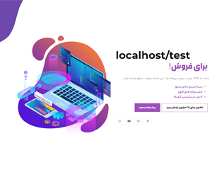
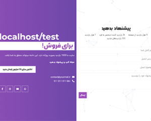
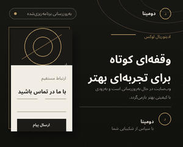

<div align="center">

# DOMINA PRO

### Maintenance · Coming Soon · Domain Landing Pages

<p>
  A professional WordPress solution for maintenance pages, coming soon screens,
  website updates, domain showcases and domain sales.
</p>

<br>

[](#)
[](#)
[](#)
[](#)
[](#)

<br>

```text
┌──────────────────────────────────────────────────────────┐
│  Secure Maintenance Mode • Elegant Templates • Full RTL │
└──────────────────────────────────────────────────────────┘
```

[English](#english) · [فارسی](#فارسی) · [Purchase License](https://www.zhaket.com/web/domina-plugin)

<br>

<a href="https://www.zhaket.com/web/domina-plugin">
  
</a>

</div>

---

<a id="english"></a>

# English

## `01.` Overview

**Domina Pro** is a professional WordPress plugin for creating maintenance, update, coming soon, domain showcase and domain sale landing pages.

It provides responsive templates, secure access controls, optimized asset loading, proper HTTP maintenance responses and full Persian/RTL compatibility.

> [!IMPORTANT]
> A valid commercial license is required for activation, official updates and vendor support.

---

## `02.` Feature Matrix

| Category | Included Features |
|---|---|
| **Templates** | Classic layouts, Editorial Luxury, responsive design |
| **Branding** | Custom logo, favicon, colors, images and page content |
| **Security** | Nonce validation, honeypot, rate limiting, input sanitization |
| **Access Control** | Administrator bypass, login and system request exclusions |
| **SEO** | HTTP `503`, `Retry-After`, optional `noindex` |
| **Performance** | Conditional CSS/JS loading and reduced external dependencies |
| **Localization** | Full Persian language and RTL layout support |

---

## `03.` Core Capabilities

```yaml
plugin:
  name: Domina Pro
  platform: WordPress
  version: 1.2.0

modes:
  - maintenance
  - coming-soon
  - website-update
  - domain-showcase
  - domain-sale

security:
  nonce: enabled
  honeypot: enabled
  rate-limit: enabled
  input-sanitization: enabled

localization:
  persian: supported
  rtl: supported
```

- Maintenance, update and coming soon pages
- Domain showcase and domain sale landing pages
- Responsive and customizable templates
- Premium **Editorial Luxury** template
- Secure contact form
- Administrator bypass
- REST API, AJAX, Cron and login exclusions
- HTTP `503 Service Unavailable`
- Configurable `Retry-After`
- Optional `noindex`
- Security and cache-control headers
- Contact details and social links
- Conditional CSS and JavaScript loading

---

## `04.` Template Gallery

<table>
  <tr>
    <td align="center" width="33%">
      <strong>Classic Template 01</strong>
      <br><br>
      
    </td>
    <td align="center" width="33%">
      <strong>Classic Template 02</strong>
      <br><br>
      
    </td>
    <td align="center" width="33%">
      <strong>Editorial Luxury</strong>
      <br><br>
      
    </td>
  </tr>
</table>

---

## `05.` Installation

```bash
# 1. Download the official ZIP package
domina-pro.zip

# 2. Open WordPress Dashboard
Plugins > Add New Plugin > Upload Plugin

# 3. Upload and activate
Activate: Domina Pro

# 4. Enter your official license
Domina Pro > License

# 5. Configure and publish
Domina Pro > Settings
```

### Recommended Deployment Flow

```text
Backup → Staging Test → Configure → Preview → Enable → Clear Cache
```

---

## `06.` Security Model

Domina Pro includes several protections for temporary landing pages:

```php
// Conceptual security flow
verify_nonce();
sanitize_user_input();
apply_rate_limit();
validate_template_path();
send_secure_headers();
```

Implemented protections include:

- WordPress nonce validation
- Honeypot-based spam protection
- Form submission rate limiting
- Input validation and sanitization
- Email header injection protection
- Approved template path validation
- Administrator capability checks
- Secure HTTP response headers
- Maintenance-page cache prevention

> [!WARNING]
> Do not disclose security vulnerabilities in public GitHub issues.  
> Report sensitive findings through the official Zhaket support channel.

---

## `07.` Maintenance Response

When Maintenance Mode is enabled, Domina Pro can return:

```http
HTTP/1.1 503 Service Unavailable
Retry-After: 3600
X-Robots-Tag: noindex, nofollow
Cache-Control: no-store, no-cache, must-revalidate
```

This helps search engines understand that the website interruption is temporary.

---

## `08.` License & Support

A valid Domina Pro license is required for:

- Authorized activation
- Official product updates
- Vendor support
- Access to licensed distribution packages

<div align="center">

### [Purchase Domina Pro License from Zhaket](https://www.zhaket.com/web/domina-plugin)

</div>

> [!NOTE]
> This repository does not provide a Zhaket activation key.  
> Never publish license keys, order information or private activation files.

---

## `09.` Bug Reports

Before submitting an issue, provide:

```text
WordPress Version:
PHP Version:
Domina Pro Version:
Active Theme:
Steps to Reproduce:
Expected Result:
Actual Result:
Relevant Log:
```

Do not include:

```text
✗ License keys
✗ Database credentials
✗ Hosting passwords
✗ Private customer information
```

---

## `10.` Contribution Guidelines

Pull requests and improvement proposals may be reviewed.

```text
Allowed:
├── UI improvements
├── Accessibility fixes
├── Performance optimizations
├── Translation improvements
└── Bug fixes

Restricted:
└── Activation and licensing modifications
```

The activation and licensing components must remain unchanged.

---

<a id="فارسی"></a>

# فارسی

<div dir="rtl">

## `۰۱.` معرفی

**دومینا پرو** افزونه‌ای حرفه‌ای برای ساخت صفحات تعمیرات، به‌روزرسانی، در دست ساخت، معرفی دامنه و فروش دامنه در وردپرس است.

این افزونه با قالب‌های واکنش‌گرا، تنظیمات امنیتی، کنترل دسترسی مدیران، پاسخ استاندارد HTTP و پشتیبانی کامل از زبان فارسی و چیدمان راست‌چین ارائه شده است.

> [!IMPORTANT]
> برای فعال‌سازی قانونی، دریافت به‌روزرسانی‌ها و استفاده از پشتیبانی رسمی، تهیه لایسنس معتبر الزامی است.

---

## `۰۲.` نمای کلی امکانات

| بخش | قابلیت‌ها |
|---|---|
| **قالب‌ها** | قالب‌های کلاسیک، Editorial Luxury و طراحی واکنش‌گرا |
| **شخصی‌سازی** | لوگو، فاوآیکون، رنگ‌ها، تصویر و محتوای صفحه |
| **امنیت** | Nonce، هانی‌پات، محدودسازی ارسال و پاک‌سازی ورودی‌ها |
| **دسترسی** | عبور مدیران و مستثناکردن درخواست‌های سیستمی |
| **سئو** | HTTP `503`، تنظیم `Retry-After` و کنترل `noindex` |
| **عملکرد** | بارگذاری شرطی CSS و JavaScript |
| **بومی‌سازی** | پشتیبانی کامل از فارسی و RTL |

---

## `۰۳.` قابلیت‌های اصلی

```yaml
افزونه:
  نام: دومینا پرو
  پلتفرم: وردپرس
  نسخه: 1.2.0

حالت‌ها:
  - تعمیرات
  - به‌زودی
  - به‌روزرسانی سایت
  - معرفی دامنه
  - فروش دامنه

امنیت:
  nonce: فعال
  honeypot: فعال
  rate-limit: فعال
  sanitization: فعال

زبان:
  فارسی: پشتیبانی‌شده
  rtl: پشتیبانی‌شده
```

- ساخت صفحه تعمیرات و به‌روزرسانی
- ساخت صفحه «به‌زودی بازمی‌گردیم»
- معرفی یا فروش دامنه
- قالب‌های واکنش‌گرا و قابل شخصی‌سازی
- قالب حرفه‌ای **Editorial Luxury**
- فرم تماس امن
- عبور مدیران مجاز
- مستثناکردن REST API، AJAX، Cron و صفحه ورود
- پشتیبانی از `503 Service Unavailable`
- تنظیم `Retry-After`
- کنترل ایندکس صفحه موقت
- افزودن هدرهای امنیتی
- بارگذاری بهینه فایل‌های CSS و JavaScript

---

## `۰۴.` گالری قالب‌ها

<table>
  <tr>
    <td align="center" width="33%">
      <strong>قالب کلاسیک ۱</strong>
      <br><br>
      
    </td>
    <td align="center" width="33%">
      <strong>قالب کلاسیک ۲</strong>
      <br><br>
      
    </td>
    <td align="center" width="33%">
      <strong>Editorial Luxury</strong>
      <br><br>
      
    </td>
  </tr>
</table>

---

## `۰۵.` نصب و راه‌اندازی

```bash
# ۱. دریافت فایل رسمی افزونه
domina-pro.zip

# ۲. ورود به پیشخوان وردپرس
افزونه‌ها ← افزودن افزونه تازه ← بارگذاری افزونه

# ۳. نصب و فعال‌سازی
فعال‌سازی: Domina Pro

# ۴. ثبت لایسنس رسمی
دومینا پرو ← لایسنس

# ۵. تنظیم و انتشار
دومینا پرو ← تنظیمات
```

### مسیر پیشنهادی انتشار

```text
پشتیبان‌گیری ← تست در Staging ← تنظیمات ← پیش‌نمایش ← فعال‌سازی ← پاک‌سازی کش
```

---

## `۰۶.` ساختار امنیتی

دومینا پرو برای کاهش ریسک‌های رایج صفحات موقت، از سازوکارهای امنیتی زیر استفاده می‌کند:

```php
// روند مفهومی پردازش امن
verify_nonce();
sanitize_user_input();
apply_rate_limit();
validate_template_path();
send_secure_headers();
```

- اعتبارسنجی Nonce وردپرس
- هانی‌پات ضداسپم
- محدودسازی دفعات ارسال فرم
- اعتبارسنجی و پاک‌سازی ورودی‌ها
- جلوگیری از تزریق هدر ایمیل
- کنترل مسیرهای مجاز قالب
- بررسی سطح دسترسی مدیران
- افزودن هدرهای امنیتی
- جلوگیری از کش‌شدن نادرست صفحه موقت

> [!WARNING]
> آسیب‌پذیری‌های امنیتی را در Issue عمومی گیت‌هاب منتشر نکنید.  
> گزارش‌های حساس را از طریق پشتیبانی رسمی محصول در ژاکت ارسال کنید.

---

## `۰۷.` پاسخ استاندارد تعمیرات

در حالت تعمیرات، افزونه می‌تواند پاسخ زیر را ارسال کند:

```http
HTTP/1.1 503 Service Unavailable
Retry-After: 3600
X-Robots-Tag: noindex, nofollow
Cache-Control: no-store, no-cache, must-revalidate
```

این پاسخ به موتورهای جست‌وجو اعلام می‌کند که اختلال سایت موقتی است.

---

## `۰۸.` تهیه لایسنس و پشتیبانی

لایسنس رسمی دومینا پرو برای موارد زیر موردنیاز است:

- فعال‌سازی قانونی افزونه
- دریافت به‌روزرسانی‌های رسمی
- استفاده از پشتیبانی محصول
- دسترسی به بسته‌های انتشار معتبر

<div align="center">

### [تهیه لایسنس Domina Pro از ژاکت](https://www.zhaket.com/web/domina-plugin)

</div>

> [!NOTE]
> این مخزن کلید فعال‌سازی ژاکت ارائه نمی‌کند.  
> کلید لایسنس، اطلاعات سفارش و فایل‌های خصوصی فعال‌سازی را عمومی نکنید.

---

## `۰۹.` گزارش خطا

هنگام گزارش خطا، اطلاعات زیر را ارائه کنید:

```text
نسخه وردپرس:
نسخه PHP:
نسخه دومینا پرو:
قالب فعال:
مراحل بازتولید:
نتیجه مورد انتظار:
نتیجه فعلی:
پیام خطا یا Log:
```

اطلاعات زیر را منتشر نکنید:

```text
✗ کلید لایسنس
✗ اطلاعات پایگاه داده
✗ رمزهای هاست
✗ اطلاعات محرمانه مشتریان
```

---

## `۱۰.` مشارکت در توسعه

پیشنهادهای بهبود و Pull Requestها قابل بررسی هستند.

```text
موارد قابل بررسی:
├── بهبود رابط کاربری
├── اصلاح دسترس‌پذیری
├── بهینه‌سازی عملکرد
├── بهبود ترجمه
└── رفع خطا

بخش غیرقابل‌تغییر:
└── ساختار فعال‌سازی و لایسنس
```

بخش فعال‌سازی و لایسنس افزونه باید بدون تغییر باقی بماند.

</div>

---

## Project Information

| Item | Details |
|---|---|
| **Product** | Domina Pro |
| **Platform** | WordPress |
| **Developer** | SHABNAM |
| **Current Version** | `1.2.0` |
| **License & Support** | [Zhaket Product Page](https://www.zhaket.com/web/domina-plugin) |
| **Developer Store** | [SHABNAM on Zhaket](https://zhaket.com/store/web/shabnam) |

---

## License Notice

The plugin header declares the code license as **GPL-2.0-or-later**.  
A valid commercial activation license purchased through Zhaket may still be required for activation services, official updates and vendor support.

---

<div align="center">

```text
Built for secure, elegant and professional WordPress maintenance experiences.
```

**Domina Pro © SHABNAM**

</div>
